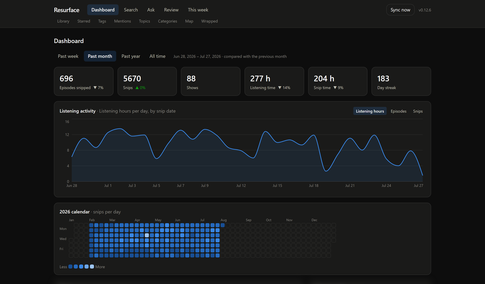
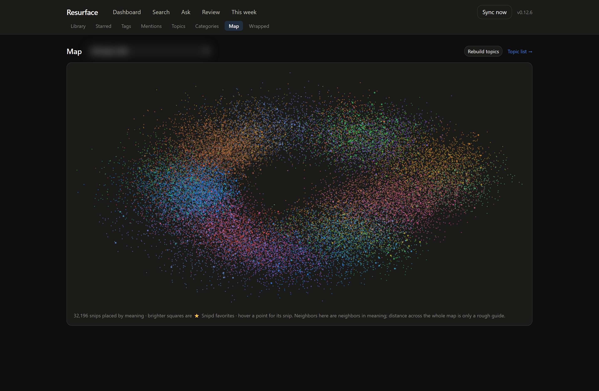
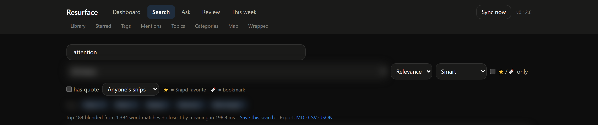
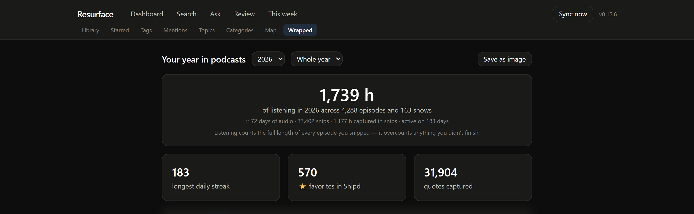

# Resurface

A local-first "second brain" for [Snipd](https://www.snipd.com) podcast notes: listening statistics, hybrid
keyword+semantic search, Q&A with citations, topic discovery and a similarity map, an editable category
taxonomy, Snipd tags and favorites, over everything you've listened to and forgotten.

**Free-only stack**, and nothing leaves your machine: Node 25 + `node:sqlite` (FTS5) + local ONNX embeddings
(`@huggingface/transformers`, `Xenova/all-MiniLM-L6-v2`). An optional local [Ollama](https://ollama.com) model
can write prose answers; without it Ask quotes your snips verbatim and still works.

🔒 **[SECURITY.md](SECURITY.md)**: what this app can and cannot reach, and the dependency advisories it
knows about.

📖 **[INSTALL.md](INSTALL.md)**: installing, updating, autostart, settings, and what to do when something
goes wrong.

📋 **[PLAN.md](PLAN.md)** is the full product & engineering plan: architecture, data model, phased roadmap,
and an "As built" record of where the implementation deliberately diverged from the plan.

## What it looks like

Real screenshots from a 33,402-snip library. **Anything that would name a show, an episode or a snip is
blurred.** These are one person's listening habits, and the pictures are here to show the app, not the
library. Nothing else is staged: the numbers, charts and timings are exactly what the app produced.



*The dashboard. Listening time and snip time are shown side by side because they measure different things
(§ Honest metrics below).*



*The similarity map: every snip placed by meaning, coloured by topic, brighter squares are Snipd favorites.
PCA by power iteration, which is deterministic and takes seconds rather than minutes.*



*Search. The line under the filters says what the count actually means ("top 184 blended from 1,384
word matches + closest by meaning"), because a hybrid result count is not comparable to a keyword one.*



*Wrapped, with the caveat printed on it rather than hidden: listening counts the full length of every episode
you snipped, so it overcounts anything you didn't finish.*

## Status

- [x] Plan (v3)
- [x] Phase 0 · Foundations: parser, schema, CLI import, import report
- [x] Phase 1 · Library + stats (dashboard, heatmap, Wrapped)
- [x] Phase 2 · Search + favorites, people & books indexes, exports
- [x] Phase 2.5 · Snipd tags, Snip time, short-form fairness
- [x] Phase 3 · Semantic layer (embeddings, related, hybrid search, topics, map)
- [x] Phase 4 · Categories + Ask (RAG with citations)
- [x] Phase 4.5 · Auto/manual snips, speaker-free topic labels, local-model setup
- [x] Phase 5 · Resurfacing (daily review, on-this-day, digest + feed, serendipity, Wrapped image)
- [x] Phase 6 · Packaging & polish (verified backups + restore, corruption watch, a11y, install docs)
- [ ] Phase 7 · Remote access (optional)

## Before you start

Resurface reads the Markdown files the **official Snipd Obsidian plugin** writes. It does not talk to
Snipd itself. So that sync has to be running first:
[Sync Your Snips to Obsidian](https://support.snipd.com/en/articles/12750692-sync-your-snips-to-obsidian).
Install the *Snipd official* plugin from Obsidian's community plugins, connect your Snipd account, and let
one sync finish. Everything below assumes a folder of snips already exists; without it there is nothing to
index.

## Running it

```
Start Resurface.bat     # build if needed, start the server, open the app
Update Resurface.bat    # pull, install, rebuild, restart
```

The server logs to `%LOCALAPPDATA%\Resurface\logs\server.log` rather than to the window it started in.
Clicking inside a Windows console freezes the process that owns it, and a running server is not something a
stray click should be able to stop. If it ever does stop answering, the app says so rather than showing you
blank pages.

Or by hand:

```
npm install
npm run import          # read the vault into SQLite (idempotent)
npm run build:web
npm run serve           # http://127.0.0.1:7433
npm test                # 197 tests
npm run typecheck
```

## How some of it works

**Search** has three modes. *Keyword* is FTS5 BM25. *Meaning* is cosine over local embeddings. *Smart*
fuses both with reciprocal rank fusion (k=60) and a small boost for Snipd favorites. Each mode reports what
its result count actually means, because the counts are not comparable.

**The meaning index** is built on your CPU in a worker thread, resumable, and throttled: the default
"Gentle" profile uses about one core at below-normal priority. The main thread never loads ONNX. After the
first build it maintains itself: snips arriving from a sync are embedded without being asked, so the index
never quietly falls behind the library and then asks to be rebuilt.

**Topics** are spherical k-means over the vectors, labelled by c-TF-IDF. Labels exclude names the export
states outright (show authors, guests, book authors, quote attributions) and weight every term by how evenly
it spreads across shows, so topics get named after ideas rather than after whoever was speaking.

**The map** is PCA by power iteration rather than UMAP: no dependency, deterministic, and seconds instead
of minutes. Points are anchored partly to their topic so the projection doesn't collapse into one blob.

**The daily review** brings back a handful of snips a day out of 32k. Weighted sampling decides what is
seen, favouring never-shown, starred and older material, and spaced repetition (3/7/21/60/180 days) decides
when it returns. "Stop showing" removes a snip from review only; it stays in the library. A weekly digest,
"on this day", serendipity and an RSS feed round it out.

**Ask** retrieves with hybrid search and then answers extractively by default: passages quoted verbatim under
`[n]` citations, so there is no model in the loop and nothing to hallucinate.

**Auto vs. manual snips** are told apart by the *shape* of the note, never its wording and never its
duration. Snipd's own template is rigidly uniform; anything structurally richer was made by hand. Low
confidence cases are listed on the dashboard for you to settle, and your correction is permanent. Any search
can be filtered to one kind or the other. It is a filter only, never a change to ranking.

**Taking it to NotebookLM.** Ask answers locally over a handful of retrieved snips. If you want a hosted
model to read the *whole* library instead, the Ask page can package it: Markdown files grouped by show or by
category, each sized inside NotebookLM's 500,000-word source limit, with the number of files kept under its
sources-per-notebook cap. Files are named after the show or topic they hold, because NotebookLM cites the
source, so an answer tells you where it came from. A short guide file goes with them explaining that the
quotes are transcribed speech, which the model otherwise gets wrong. There is nothing to connect: consumer
NotebookLM has no API, so you upload the folder once, by hand.

**Reading in place.** Every snip in search, review, the digest, Starred and Ask expands where it sits to show
its full note and transcript, fetched only when opened, so long lists stay light. The episode pages still
exist; they're just no longer the only way to read something.

**Backups** run on their own, because your review history, bookmarks and category names exist nowhere but
this database, and everything else can be rebuilt from the vault. A full snapshot is taken daily via
`VACUUM INTO` (a clean, already-checkpointed copy, safe to take while the app is running), and each one is
opened and integrity-checked before it's kept. Alongside it, a few-kilobyte `work-*.json` holds just the
irreplaceable rows. Restore from the dashboard in seconds; the database being replaced is moved aside, never
deleted. Snapshots are ~320 MB each and three are kept by default. Set `backupKeep` in `config.json` to
change that. The app also quick_checks itself on a timer and says so loudly the moment a page goes bad,
while a verified snapshot from hours ago is still sitting there.

## Principles worth knowing

- **Never delete.** Content missing from the vault is flagged "not in vault" and stays in the library,
  search and stats forever. Imports are additive.
- **The vault is read-only.** Resurface never writes to your Obsidian folder.
- **Snipd's words vs. ours.** *Favorites* = ⭐ starred in Snipd (imported, read-only). *Bookmarks* = starred
  in Resurface. *Tags* = from Snipd (read-only). *Categories* = your own editable taxonomy.
- **Honest metrics.** *Listening time* uses full episode length and so overcounts anything you didn't
  finish; *Snip time* is the audio your snips actually captured. Both are shown.
- **Organising is not endorsing.** Tags and auto/manual never boost search ranking.

## License

MIT. See [LICENSE](LICENSE).

## Note on data

This repo contains **code only**. Your Snipd vault, the SQLite database and the model cache are excluded via
`.gitignore` and live in `%LOCALAPPDATA%\Resurface\` (see PLAN.md §13).
